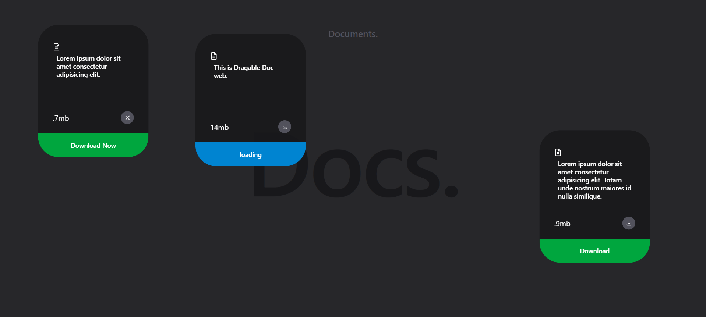

# 📝 Draggable Doc App

A simple and interactive draggable document editor built with **React.js**, powered by **Framer Motion** for smooth drag animations, and styled using **Tailwind CSS**.

 <!-- Optional: Replace with your actual screenshot path -->

## 🚀 Features

- 📄 Create and edit documents
- 🖱️ Drag-and-drop interface powered by Framer Motion
- 🎨 Styled beautifully with Tailwind CSS
- ⚡ Fast and lightweight React-based UI

## 🛠️ Built With

- [React.js](https://reactjs.org/)
- [Framer Motion](https://www.framer.com/motion/)
- [Tailwind CSS](https://tailwindcss.com/)
